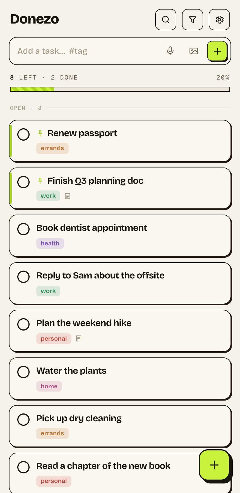
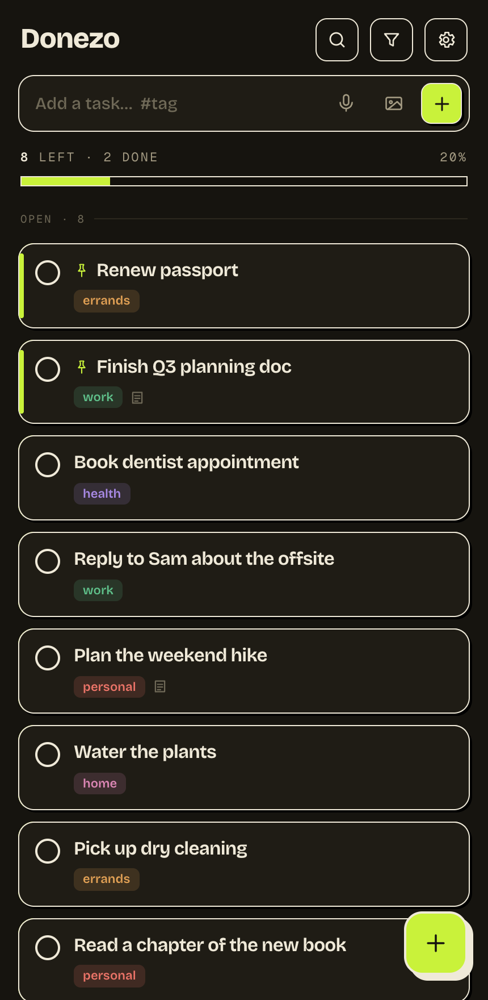

# Donezo

A fast, private to-do app you can host yourself. Add a task, swipe to finish it, and it syncs live across your phone and laptop. No accounts, no cloud, no tracking — your tasks live on your own machine.

<p align="center">
  
  
</p>

## What it does

- **Quick capture** — type a task, add a `#tag`, hit enter. That's it.
- **Swipe gestures** — swipe to finish or pin a task.
- **Tags with colors** — group tasks your way; pick a color per tag.
- **Live sync** — changes show up instantly on your other devices.
- **Works offline** — add and check off tasks with no connection; it catches up later.
- **Install like an app** — add it to your phone's home screen (it's a PWA).
- **Light & dark** — follows your system, or pick one.
- **Notes & photos** — attach a note or an image to any task.
- **Yours to keep** — everything is stored in a plain folder on your server, with automatic daily backups.

## Run it yourself

You'll need [Docker](https://docs.docker.com/get-docker/). Then:

```bash
git clone https://github.com/ijoshi129/donezo.git
cd donezo
docker compose up -d --build
```

Open **http://localhost:4173** and you're running. Your tasks are saved in the `data/` folder right next to the app — back that folder up and you've backed up everything.

To set your timezone (used by the optional "clear finished tasks at noon" feature), edit the `TZ:` line in `compose.yaml` — for example `TZ: Europe/London`.

To update later:

```bash
git pull
docker compose up -d --build
```

## Put it on your phone

To install Donezo to your home screen, your phone needs to reach it over **https** (browsers only allow app-install on secure sites). The easiest way is to point a domain at your server and put a reverse proxy in front (for example [Nginx Proxy Manager](https://nginxproxymanager.com/), Caddy, or Traefik) to add the https.

One thing to set in your proxy: Donezo's live-sync uses a streaming connection at `/api/events`. Most proxies buffer responses by default, which holds up that stream — turn buffering **off** for that path (in Nginx: `proxy_buffering off;`). Everything else works with default settings.

Once it's on https, open it on your phone and choose **Add to Home Screen**.

## Running without Docker

You need Node.js 20+. Build the front-end once, then start the server:

```bash
cd web && npm install && npm run build && cd ..
node server.js
```

It serves on port 4173 (set `PORT` to change it) and stores data in `./data` (set `DATA_DIR` to change it).

## Under the hood

A small Node.js server (no framework, no dependencies) serves a React front-end and a tiny API. Tasks are kept in a single JSON file with atomic writes and daily backups — simple to read, simple to back up, hard to corrupt.

---

Originally forked from [KiranTheRam/donezo](https://github.com/KiranTheRam/donezo).
